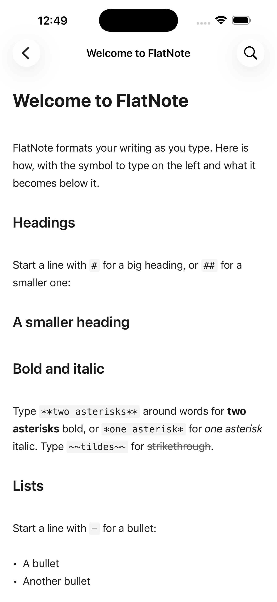

# FlatNote

A markdown notes app for iPhone and iPad that keeps your writing plain,
portable, and yours.

Type markdown and watch it format as you go. Headings, bold, italic,
strikethrough, links, quotes, bullet lists, and tappable checkboxes all render
while you write. The raw symbols stay out of your way and reappear only on the
line you are editing, so you always know exactly what you typed.

<p align="center">
  
</p>

## Why FlatNote

Every note is a plain `.md` file. No proprietary format, no lock-in, readable in
any app, on any device, years from now. Your notes live in your own iCloud and
sync across your devices through your Apple ID, with no separate account to make
and no server in the middle. No ads, no tracking, no analytics. Nothing about
you leaves your devices and your iCloud.

## Features

- **Live formatting** that hides the syntax and reveals it on the line you edit
- **Tappable checkboxes**, bullet and numbered lists, headings, emphasis, links,
  quotes, and code
- **Find in a note** with highlighted matches and next/previous navigation
- **Formatting bar** above the keyboard for bold, italic, headings, lists,
  checkboxes, and links
- **Library search** across titles and note contents
- **iCloud sync** with a graceful local fallback when iCloud is off
- **Export and share** any note as markdown; all notes are visible in the Files
  app
- **iPhone and iPad**, light and dark, portrait and landscape

## Build and run

Requires Xcode 17+ and iOS 17+.

```bash
open FlatNote.xcodeproj
```

Pick a simulator or a device and run. To use iCloud sync on a device, enable the
iCloud capability under the FlatNote target's Signing & Capabilities with your
own team and container, since the bundled entitlement points at a specific
iCloud container.

## Tests

```bash
xcodebuild test -project FlatNote.xcodeproj -scheme FlatNote \
  -destination 'platform=iOS Simulator,name=iPhone 17'
```

The suite covers the note store (file operations, titling, export, import
dedup), the markdown stripper, and the editor renderer (exercised in
JavaScriptCore against `render.js`).

## How it works

FlatNote is SwiftUI around a small, focused web-based editor.

- `FlatNote/NoteStore.swift` — the model: plain `.md` files in the iCloud
  Documents container (or local Documents), coordinated reads and writes, and
  note titling from the first line.
- `FlatNote/NoteLibraryView.swift` — the library, search, settings, and export.
- `FlatNote/EditorView.swift` — hosts the editor in a `WKWebView` and bridges
  saving, find, and the formatting bar to it.
- `FlatNote/Resources/editor.html` — the live editor: a contenteditable surface
  whose rendered DOM always maps one-to-one to the markdown source, so the
  cursor stays exact.
- `FlatNote/Resources/render.js` — the pure markdown-to-HTML line renderer,
  separated out so it can be unit-tested headlessly.

## Privacy

FlatNote collects nothing. See [appstore/PRIVACY.md](appstore/PRIVACY.md).

## License

MIT. See [LICENSE](LICENSE). The FlatNote name and app icon are not covered by
the code license.
